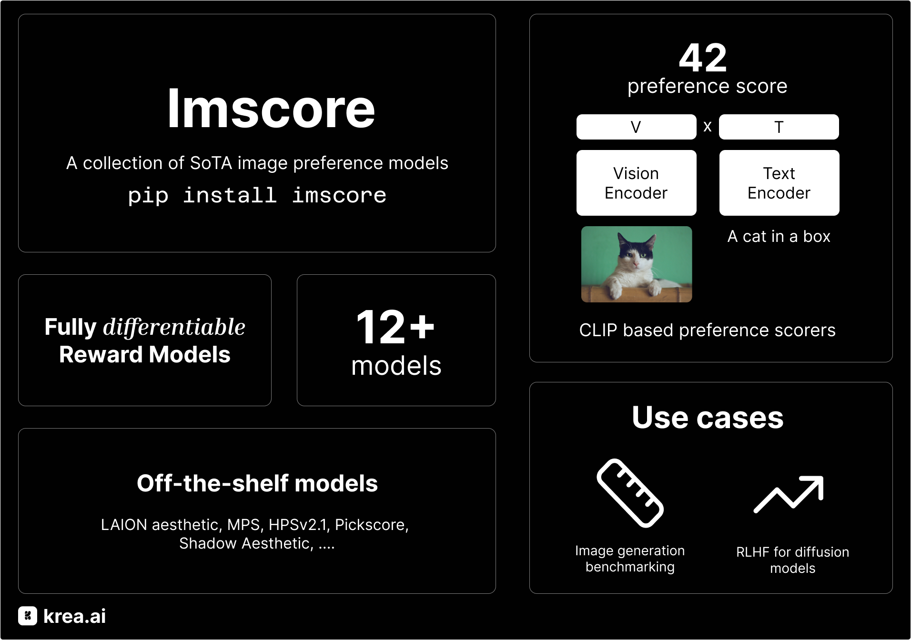

# Imscore
**Work by RE-N-Y and friends @ [krea.ai](https://krea.ai)**



Imscore is a minimal library curating a set of **fully differentiable** aesthetic and preference scorers for images.
We provide a set of popular scorers such as PickScore, MPS, HPSv2, and LAION aesthetic scorer as well as our own models trained on open source preference datasets.

`imscore` allows ...

1. **Benchmarking** your generative models on aesthetic and preference scorers.
2. **Post training** your generative models to align with human preference.
3. **Prevent headaches** of porting over models from different repositories.


## Installation

```bash
pip install imscore
```

## Usage

```python
from imscore.aesthetic.model import ShadowAesthetic, LAIONAestheticScorer
from imscore.hps.model import HPSv2
from imscore.mps.model import MPS
from imscore.preference.model import SiglipPreferenceScorer
from imscore.pickscore.model import PickScorer

import torch
import numpy as np
from PIL import Image
from einops import rearrange

# popular aesthetic/preference scorers
model = ShadowAesthetic() # ShadowAesthetic aesthetic scorer (my favorite)
model = PickScorer() # PickScore preference scorer
model = MPS.from_pretrained("RE-N-Y/mpsv1") # MPS (ovreall) preference scorer
model = HPSv2.from_pretrained("RE-N-Y/hpsv21") # HPSv2.1 preference scorer
model = LAIONAestheticScorer.from_pretrained("RE-N-Y/laion-aesthetic") # LAION aesthetic scorer

# multimodal (pixels + text) preference scorers trained on PickaPicv2 dataset 
model = SiglipPreferenceScorer.from_pretrained("RE-N-Y/pickscore-siglip")

prompts = "a photo of a cat"
pixels = Image.open("cat.jpg")
pixels = np.array(pixels)
pixels = rearrange(torch.tensor(pixels), "h w c -> 1 c h w") / 255.0

# prompts and pixels should have the same batch dimension
# pixels should be in the range [0, 1]
# score == logits
score = model.score(pixels, prompts) # full differentiable reward
```

## Post Training for Generative Models

```python
import torch
from imscore.preference.model import SiglipPreferenceScorer

G = model() # your generative model
dataloader = ... # your dataloader with conditioning (ex.prompts)

rm = SiglipPreferenceScorer.from_pretrained("RE-N-Y/pickscore-siglip") # pretrained preference model
optim = torch.optim.AdamW(G.parameters(), lr=3e-4)

# post training
for prompts in dataloader:
    optim.zero_grad()
    
    images = G(prompts)
    scores = rm.score(images, prompts) # ensure images are in the range [0, 1]
    loss = -scores.mean() # maximise reward

    loss.backward()
    optim.step()
```

## List of available models

### Aesthetic Scorers
```python
from imscore.aesthetic.model import ShadowAesthetic, CLIPAestheticScorer, SiglipAestheticScorer, Dinov2AestheticScorer, LAIONAestheticScorer

# pixel only scorers trained on imscore dataset's aesthetic rating
SiglipAestheticScorer.from_pretrained("RE-N-Y/imreward-fidelity_rating-siglip")
CLIPAestheticScorer.from_pretrained("RE-N-Y/imreward-fidelity_rating-clip")
Dinov2AestheticScorer.from_pretrained("RE-N-Y/imreward-fidelity_rating-dinov2")

# pixel only scorers trained on imreward dataset's overall rating
SiglipAestheticScorer.from_pretrained("RE-N-Y/imreward-overall_rating-siglip")
CLIPAestheticScorer.from_pretrained("RE-N-Y/imreward-overall_rating-clip")
Dinov2AestheticScorer.from_pretrained("RE-N-Y/imreward-overall_rating-dinov2")

# pixel only scorers trained on AVA dataset
CLIPAestheticScorer.from_pretrained("RE-N-Y/ava-rating-clip-sampled-True")
CLIPAestheticScorer.from_pretrained("RE-N-Y/ava-rating-clip-sampled-False")
SiglipAestheticScorer.from_pretrained("RE-N-Y/ava-rating-siglip-sampled-True")
SiglipAestheticScorer.from_pretrained("RE-N-Y/ava-rating-siglip-sampled-False")
Dinov2AestheticScorer.from_pretrained("RE-N-Y/ava-rating-dinov2-sampled-True")
Dinov2AestheticScorer.from_pretrained("RE-N-Y/ava-rating-dinov2-sampled-False")


LAIONAestheticScorer.from_pretrained("RE-N-Y/laion-aesthetic") # LAION aesthetic scorer
ShadowAesthetic() # ShadowAesthetic aesthetic scorer for anime images
```

### Preference Scorers
```python
from imscore.hps.model import HPSv2
from imscore.mps.model import MPS
from imscore.preference.model import SiglipPreferenceScorer, CLIPPreferenceScorer
from imscore.pickscore.model import PickScorer

HPSv2.from_pretrained("RE-N-Y/hpsv21") # HPSv2.1 preference scorer
MPS.from_pretrained("RE-N-Y/mpsv1") # MPS (ovreall) preference scorer
PickScorer() # PickScore preference scorer

# multimodal scorers trained on PickAPicv2 dataset
SiglipPreferenceScorer.from_pretrained("RE-N-Y/pickscore-siglip") # SoTA on pickapicv2 test set
CLIPPreferenceScorer.from_pretrained("RE-N-Y/pickscore-clip") # Good model for post training
```


## Benchmarks

| Dataset | Model | Performance |
| --- | --- | --- |
| ImageReward (overall rating) | imreward-overall_rating-siglip | 1.147 |
| ImageReward (overall rating) | imreward-overall_rating-clip | 1.213 |
| ImageReward (overall rating) | imreward-overall_rating-dinov2 | 1.111 |
| ImageReward (aesthetic rating) | imreward-fidelity_rating-siglip | 0.857 |
| ImageReward (aesthetic rating) | imreward-fidelity_rating-clip | 0.859 |
| ImageReward (aesthetic rating) | imreward-fidelity_rating-dinov2 | 0.845 |
| AVA () | ava-rating-clip-sampled-True | 0.228 |
| AVA | ava-rating-clip-sampled-False | 0.236 |
| AVA | ava-rating-siglip-sampled-True | 0.292 |
| AVA | ava-rating-siglip-sampled-False | 0.276 |
| AVA | ava-rating-dinov2-sampled-True | 0.264 |
| AVA | ava-rating-dinov2-sampled-False | 0.265 |
| LAION | laion-aesthetic | 0.321 |
| PickAPicv2 (test + no ties) | pickscore | 69.67% |
| PickAPicv2 (test + no ties) | pickscore-siglip | x |
| PickAPicv2 (test + no ties) | pickscore-clip | x |
| ??? | ShadowAesthetic v2 | ??? |

Note : Imreward uses 1-7 likert scale, AVA uses 1-10 likert scale, PickAPicv2 asks model/user to pick the better image given a prompt. Shadow Aesthetic v2 is an anime aesthetic scorer with ViT backbone, training recipe and objective is not disclosed.


## Why did I make this?

1. To save myself headaches.
2. To provide a common interface for dataset filtering, posttraining, and image model benchmarking.